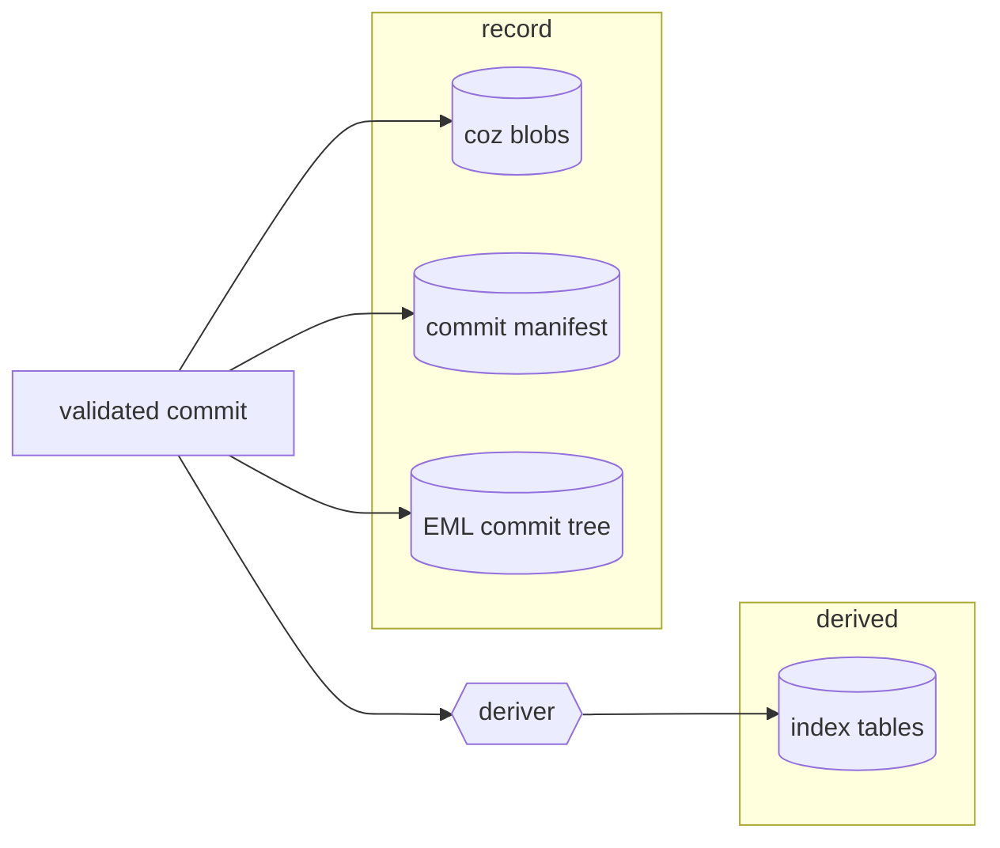
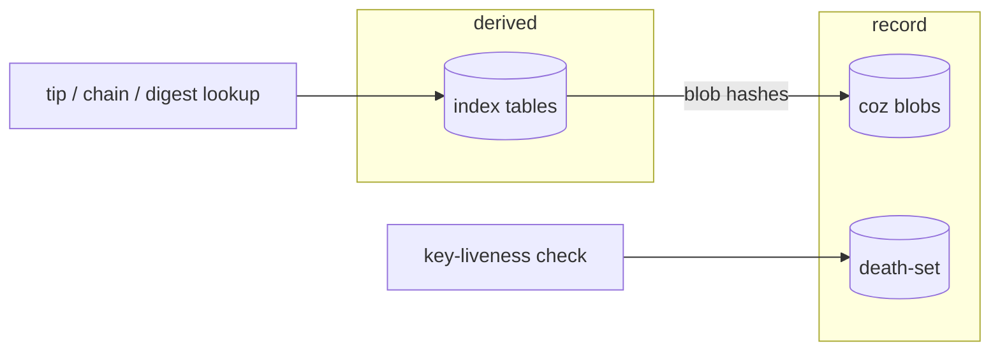
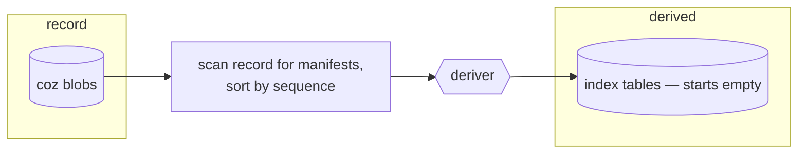

# Proposal: layer durable storage by authority

The server's durable storage is grouped by which database a thing lives
in. It should be grouped by whether the server was **told** it or
**worked it out** — and that is the difference between data you can
delete and data you cannot get back.

**Status, scope, and how to read this.** This is a proposal, not a
specification: it adds no requirements and asks for three yes/no answers
(§5). Scope: the server's on-disk layout and the index's write
discipline; nothing here touches the wire format, protocol semantics, or
the client. Every claim about current behavior was checked against
source at the revision this proposal was written against, not against
the specifications describing it — the two have diverged, and where they
have, this document says so. Each section can be refused on its own: §1
proposes the cut and names the alternatives it rejects; §2 shows the
mixture that exists today and the harm it produces, and is wrong only if
a cited fact is wrong; §3 derives what the cut buys; §4 prices it; §5
asks the questions. "I accept through §2 and reject §3" is a coherent
position, and so is refusing at any other numbered step.

## 1. The proposed cut

Split the durable store by **authority** — what the server is _told_
versus what it _works out_ — instead of by storage technology.

Everything the server is told is irreplaceable by definition: it arrived
from outside and no replay recreates it. Everything the server works out
is reproducible by definition: it is a function of the record. The first
kind belongs together in a **record** layer; the second is a **derived**
layer that can always be discarded.

### 1.1 Layout, current and proposed

Both panels contain the same stores; nothing is added or dropped.

**Current — grouped by storage technology** (one directory per embedded
database):

```text
data_dir/
├── blobs/                  record (+ derived EML keyspaces inside)
├── index/                  derived
├── observations/           record
├── admission/              record
└── server-principal.json   record
```

**Proposed — grouped by authority:**

```text
data_dir/
├── record/                 what the server was told; losing any of it
│   │                       is irreversible
│   ├── blobs/                  (+ derived EML keyspaces inside, unchanged
│   │                              — the one flagged exception, see §4)
│   ├── observations/
│   ├── admission/
│   └── server-principal.json
└── derived/                what the server works out; losing it costs
    └── index/                  a rebuild
```

What moved: `observations/`, `admission/`, and `server-principal.json`
moved beside `blobs/` under `record/`. What did not move: `index/` (it is
regrouped, not changed), the contents of every database, and the EML
keyspaces, which stay co-located inside the `blobs/` database for the
one-WAL atomicity the engine gets from sharing it
(`rs/cyphr-blob-fjall/src/lib.rs:70-82`) — a derived structure inside the
record layer, carried as a named exception and priced in §4.

The current technology cut is not an accident: one directory per
embedded database means failure domains map one-to-one onto paths
(`rs/cyphr-server/src/lib.rs:112-127`), and the opposing position in one
sentence is _the split by database is the physically true one, and what
a directory means belongs in documentation, not in the path._ The
answer: the physical truth is preserved — each store remains its own
database, its own failure domain; only the grouping above it changes —
and §2 is the evidence that "meaning belongs in documentation" has
already failed once at the layout's own expense.

### 1.2 Alternatives considered and rejected

- **Keep the layout; add checks and documentation.** Rejected: a check
  catches the violation after it lands and a table informs only the
  operator who reads it — as the _only_ move they harden the symptom and
  leave the cause (the checks are worth having; §3 keeps both).
- **Cut by regenerability instead of authority.** Same partition today,
  rejected for the causal direction: regenerability classifies stores by
  an outcome, so it can say what to back up but cannot say what may be
  _written_ where; authority yields regenerability as a theorem and a
  write rule besides (§3.3).
- **Fold the death-set into the record store as content-addressed
  blobs.** Rejected: the refusal check would ride a derived projection —
  a window in which a dead key answers as alive
  (`observation.rs:110-116`), where today's store acknowledges a death
  only after its own fsync (`observation.rs:96-102`); spent-token
  entries mutate where immutable blobs cannot (`admission.rs:541-585`);
  and the blob store's declared scope is protocol messages
  (`docs/specs/blob-store.md`), which a spent-token hash is not.
- **Do nothing; the module docs already explain it.** They do
  (`observation.rs:1-17`) — in a `//!` comment only the implementer
  sees, and documentation that only the implementer sees protects only
  the implementer.

## 2. The defect the current cut produces

One row per durable store.

| Store                    | Holds                                   | Authority                                       | Regenerable                                                                                                                                            | Documented by                                                                                                                                                                                                  |
| :----------------------- | :-------------------------------------- | :---------------------------------------------- | :----------------------------------------------------------------------------------------------------------------------------------------------------- | :------------------------------------------------------------------------------------------------------------------------------------------------------------------------------------------------------------- |
| `blobs/` (blob keyspace) | commit/coz content and commit manifests | told                                            | no — this is the record                                                                                                                                | `SPEC.md:3149` (§16.3.2), `docs/specs/blob-store.md`, `docs/specs/blob-store-fjall.md`, `docs/guides/operating-a-server.md:305-311`                                                                            |
| `blobs/` (EML keyspaces) | each principal's commit-tree state      | worked out from the chain                       | replay reconstructs principals from blobs (`engine/mod.rs:670-720`); a byte-level regeneration path for a lost EML keyspace is not documented anywhere | `docs/specs/blob-store-fjall.md:61-85` (co-location mandate; its fjall-1 vocabulary is stale)                                                                                                                  |
| `index/`                 | six keyspaces (appendix)                | worked out                                      | yes — `rm -rf data/index` plus rebuild is a documented, supported operation (`docs/guides/operating-a-server.md:327-333`)                              | `SPEC.md:3156`, `docs/specs/storage-engine.md`, `docs/specs/indexer.md`                                                                                                                                        |
| `observations/`          | the key death-set                       | told (arrives out of band; no chain records it) | **no**                                                                                                                                                 | nothing under `docs/specs/` — `git grep -ilE 'observation\|death.set\|admission\|spent' docs/specs/` returns no matches; only the operator guide (`:309, :320-324`) and the module doc (`observation.rs:1-17`) |
| `admission/`             | spent invite tokens                     | told                                            | **no**                                                                                                                                                 | nothing under `docs/specs/` (same grep); operator guide only (`:310`)                                                                                                                                          |
| `server-principal.json`  | the server's own genesis record         | told                                            | by hand, from the signing key                                                                                                                          | operator guide (`:311, :348`)                                                                                                                                                                                  |

Reading down the _Authority_ column against the layout: three stores
holding what the server was told — two of them invisible to the
specification layer — sit as siblings of the one store that is
explicitly safe to delete.

Deleting the index to force a rebuild is a documented, supported operation
— the operator guide prints the exact command
(`docs/guides/operating-a-server.md:327-333`):

```sh
rm -rf data/index
cyphr-server rebuild-index --data-dir ./data
```

`observations/` sits directly beside `index/`: same parent directory, same
kind of fjall directory tree inside. An operator who has internalized "these directories are the
server's databases, and the index one is disposable" and deletes one
directory too many has silently revived every key whose holder declared it
dead — the guide's own words: "Every key declared dead comes back to life"
(`operating-a-server.md:309`). Nothing about the path, the name, or the
layout distinguishes the disposable database from the unrecoverable one —
and the same is true at the level where backup tooling operates, paths.
The knowledge that separates them exists in exactly one place: a
hand-maintained table in the operator guide
(`operating-a-server.md:305-311`), and a guide table is not consulted by
`rm -rf`.

## 3. What follows mechanically

Three consequences. Each is stated with the decision it changes; a
consequence that changes no decision does not appear here.

### 3.1 Index membership becomes a test, not a judgment

Under the authority cut the index's definition is: **a thing belongs in
the index exactly when replaying the record produces it.** That is a
runnable comparison — rebuild into a fresh location, diff — where today's
definition ("the index is a derived projection") is a classification
someone asserts per store, in prose.

_Decision changed:_ how "does X belong in the index?" gets adjudicated.
The death-set answered that question by argument in a module doc
(`observation.rs:5-11`) — correctly, but nothing would have caught the
opposite conclusion. Under the membership test the same question is
answered by the first rebuild: anything present that the replay does not
produce is a violation, mechanically. The judgment call this project
already had to get right by hand becomes one nobody gets to make.

The test reads "reproducible from what the record _retains_", not from
what the server once received. The distinction has already cost this
project once: intra-commit order arrived on the wire, was not retained,
and had to be recovered — which is why the commit manifest exists at all
(`engine/mod.rs:127-141`). The manifest is the retained form of the
ingest; the test is anchored to it.

### 3.2 The table registry becomes the deriver's output, never a declaration

Today's `index_meta` keyspace is a hardcoded list of five partition names,
written once at first open and never read again — its only read is an
existence check guarding the initial insert
(`rs/cyphr-index-fjall/src/lib.rs:174-187`). It documents; it governs
nothing. A sixth table added without touching it would be tracked by
nothing and noticed by nothing.

Under the cut, the registry is _generated by the derivation_: the deriver
records what it produced, and the check after any rebuild is a set
comparison — tables present in the index versus tables the rebuild
produced. A table present but not produced is undeclared durable state,
caught the first time anyone rebuilds.

_Decision changed:_ what it takes to add an index table. Today: write the
table, remember to edit a list nothing reads, and hope. Under the cut: add
a derivation rule; the registry updates because it is the derivation's
output, and rebuild-and-compare covers the new table because it compares
whatever the deriver produces. No registry edit, no schema migration, no
new check to write — which also makes being wrong about a table cheap
(one rebuild), and the query set is the part of this design least likely
to be right early.

### 3.3 One writer, and it is a function of record events

The strongest consequence does not check the property — it removes the
API that could violate it: **the index has exactly one writer, and that
writer is a pure function from record events to index entries.** There is
no call that puts an arbitrary key into the index. Incremental
maintenance is the same function applied to one event; rebuild is the
same function applied to all of them. The death-set cannot end up in the
index because no code path exists that would put it there.

Today's write path already has this shape — every index write in the
workspace originates at record content (`ingest_commit` derives entries
from the same `IndexableCommit` the commit manifest durably records,
`engine/mod.rs:587-601`; recovery and rebuild derive from the manifests
themselves, `engine/mod.rs:637-664, 1206`). But it has this shape as a
habit, not a rule: the engine exposes raw accessors that bypass it by
design (`engine/mod.rs:297-300`), and nothing prevents tomorrow's feature
from writing the index directly.

_Decision changed:_ the index's public write surface — from "callers are
trusted to route writes through the deriver" to "the deriver is the only
write path that exists." This is the move from checking to structure:
§3.1's test finds a violation after it lands; this makes it unwritable.
The test stays worth running — it is what catches a deriver that is
itself wrong, which structure cannot.

The three data flows. Write and rebuild share the deriver box
deliberately: rebuild is not a repair procedure, it is the same derivation
applied to the whole record instead of one event.

**Write** — a commit passes in-memory validation, then:



Blobs land first, then the manifest — the durable commit point
(`engine/mod.rs:498-537`). The manifest write and the deriver are two
consumers of one value: the deriver is handed the same in-memory commit
content the manifest durably records (`engine/mod.rs:587-601`); it never
reads the manifest back off disk — only rebuild does (`:637-664`), which
is the honest difference between this diagram and the rebuild one. One
inbound arrow into the index, and the content it carries is record
content — the manifest's own.

**Read** — a lookup consults the derived layer for location and the
record for content; a key-liveness check consults the record directly and
never the index:



What a read does _not_ do is as load-bearing as what it does: no state
lookup consults the death-set, no liveness check consults the index, and
nothing reads raw blobs except through hashes the index resolved — or
through full replay, which is verification, not lookup.

**Rebuild** — start from an empty index, scan the record for commit
manifests, apply the same deriver in sequence order:



Beside the write flow this is visibly the same derivation over the whole
record rather than a delta — which is what makes §3.1's membership test
meaningful: if `apply(one event)` and `derive(whole record)` are ever
different functions, the system holds two answers to one question, and
rebuild-and-compare is the only thing that will say so.

## 4. Costs

Priced against the fact that this system has no deployed users: migrating
the death-set — a move of exactly the data that cannot be regenerated if
the move is wrong — is real work deserving more care than its size
suggests, but with nothing deployed it is a schedule item, not a risk, and
this section does not lean on it.

**The cut's clean statement is already violated by the engine's own
atomicity choice, and this proposal keeps the violation.** The EML
commit-tree keyspaces are derived state living inside the record's
database, co-located for one WAL and cross-keyspace atomic batches
(`rs/cyphr-blob-fjall/src/lib.rs:70-82`; mandated by
`docs/specs/blob-store-fjall.md:61-75`). Resolving it costs one of two
things: carve the exception (which §1.1 does — and every named exception
weakens the rule it is carved from, in exactly the way this proposal
criticizes the current layout for) or move EML out and pay for
coordinated atomicity across databases. A reasonable person can vote no
here: _a layering principle that exempts the engine's own largest derived
structure is a naming convention with better marketing._ The answer — the
exception is single, named, and priced, where the current layout's
mixtures are unnamed and unpriced — is an argument, not a proof.

**One writer forbids convenient durable memoisation, permanently.** The
first time a feature wants to durably cache something not derivable from
the record — a delivery cursor, a negotiated peer state, a computed-once
external fact — the design says no: it goes into the record layer with a
real durability story, or it does not exist. That is the point, and it
will chafe on every such feature forever. This is a standing tax on
future work, and grounds a reasonable no from anyone who weighs
convenience across the system's lifetime above the enforceability §3.3
buys.

**The membership test forecloses a class of accelerator.** "Reproducible
from the retained record" excludes any structure whose contents depend on
randomness or construction order — a seeded bloom filter, a
sampling-based sketch. If one is ever wanted, the honest repair is to
weaken the index's definition to "derived _or_ disposable-nondeterministic",
which gives back a piece of what §3.1 bought. No such structure is needed
today; the cost is carried by the future.

**Rebuild-and-compare grows with the record, without bound.** As a
per-commit check it dies of its own weight on a large corpus; the
realistic shape is a fixture-corpus run per commit and a full-corpus run
on a schedule, which means the strongest content check runs least often
exactly where the record is largest.

## 5. The decision

Three questions, each answerable yes or no on its own. They are ordered
by dependency — 2 presupposes a yes to 1, and 3 presupposes a yes to 2 —
but they are separable: "yes to the regrouping, no to the enforcement"
is a coherent vote, and so is any other prefix. This proposal's own
position is that the three are strongest taken together, because §3's
consequences chain through all of them; the vote is still per question.

**Question 1 — the regrouping.** Shall durable storage be cut by
authority — a `record/` layer holding everything the server is told
(blobs, death-set, spent invite tokens, its own principal record) and a
`derived/` layer holding everything it works out (the index), per §1.1?

One condition attaches to a yes: the EML commit-tree keyspaces remain
inside the record's blob database — the named co-location exception of
§1.1 and §4. It is a condition, not a fourth question, because refusing
it means demanding those keyspaces move to the derived layer, which §4
prices as paying for coordinated atomicity across databases — the one
cost this proposal declines to pay.

Answering **yes** commits to the §1.1 layout, including migrating the
death-set — the least-regenerable data in the system — and amending the
documents listed below. Answering **no** commits to: the current layout
stands; the operator guide's table remains the sole defense against
§2's deletion and backup errors; and the two undocumented record stores
remain invisible to the specification layer unless documented where
they lie.

**Question 2 — sole-writer enforcement.** Shall the deriver — a pure
function from record events to index entries — be the only write path
into the index, removing the raw accessors that bypass it (§3.3)?

Answering **yes** commits to deleting the bypass surface
(`engine/mod.rs:297-300`) and accepting §4's standing tax: no durable
memoisation outside the record, ever. Answering **no** commits to: the
discipline the code already follows stays a habit, not a rule; any
future feature may write the index directly and nothing structural
stops it; and §3.1's membership test becomes the only line of defense,
catching violations after they land instead of making them unwritable.

**Question 3 — the generated registry.** Shall the index registry be
the deriver's generated output, checked by rebuild-and-compare,
replacing the hand-maintained `index_meta` partition list (§3.1–3.2)?

Answering **yes** commits to building rebuild-and-compare and running
it on the schedule §4 concedes it needs, and to retiring the hardcoded
list. Answering **no** commits to: `index_meta` remains a write-once
list nothing reads; a table added without editing it is tracked by
nothing and noticed by nothing; and index membership remains a
per-store judgment argued in module docs rather than a runnable test.

## Relation to existing documents

Enumerated before drafting. Dispositions describe what acceptance of this
proposal would imply; this document itself changes none of them.

| Document                            | Disposition if accepted                                                                                                                                                                                                    |
| :---------------------------------- | :------------------------------------------------------------------------------------------------------------------------------------------------------------------------------------------------------------------------- |
| `SPEC.md` §16                       | untouched by this proposal — its §16.3.2 "relational" label (`SPEC.md:3156`) is contradicted by the shipped implementation under either answer; amending it is its owner's call, and this proposal supplies the motivation |
| `docs/specs/storage-engine.md`      | amended — two-layer separation survives; the "relational" noun, the layout description, and the registry's role change                                                                                                     |
| `docs/specs/indexer.md`             | amended — gains the membership test, the one-writer contract, and the generated registry; its rebuildability claims survive unchanged                                                                                      |
| `docs/specs/blob-store.md`          | untouched — the record layer keeps the trait as it stands                                                                                                                                                                  |
| `docs/specs/blob-store-fjall.md`    | untouched by this proposal — the physical layout does not change (its pre-existing staleness is reported separately, not smuggled in here)                                                                                 |
| `docs/guides/operating-a-server.md` | amended — the data-directory section is redrawn; the warning its table carries today becomes what the layout itself says                                                                                                   |

## Appendix: what the system stores today

A keyed server run under `policy = "invite"` opens four embedded databases
and one JSON file beneath its data directory
(`rs/cyphr-server/src/lib.rs:112-127`, `rs/cyphr-server/src/admission.rs:119`,
`rs/cyphr-server/src/auth/principal.rs:39`):

```text
data_dir/
├── blobs/                  fjall database: coz blobs, commit manifests,
│                           and every principal's EML commit-tree keyspaces
├── index/                  fjall database: six index keyspaces
├── observations/           fjall database: the key death-set
├── admission/              fjall database: spent invite tokens
└── server-principal.json   plain JSON file
```

Each directory is a separate fjall database (an LSM key-value store) with
its own write-ahead log, opened at its own path. There is no SQL engine
anywhere in the workspace; the specification text calling Layer 1 "a
relational index" (`SPEC.md:3156`, repeated at
`docs/specs/storage-engine.md:73-76`) describes a design that was retired —
the implementation's own module documentation reads "never a relational
database" (`rs/cyphr-index-fjall/src/lib.rs:1-6`).

### Key/value shapes

One row per keyspace, as the bytes appear on disk. Values marked _JSON_
are `serde_json` encodings of the named struct
(`rs/cyphr-index-fjall/src/lib.rs:107-113`,
`rs/cyphr-storage/src/index/types.rs`).

| Store                   | Keyspace                                                                                                        | Key, as on disk                                                                                                                                                                        | Value, as on disk                                                                                                             | Access pattern                                                                            |
| :---------------------- | :-------------------------------------------------------------------------------------------------------------- | :------------------------------------------------------------------------------------------------------------------------------------------------------------------------------------- | :---------------------------------------------------------------------------------------------------------------------------- | :---------------------------------------------------------------------------------------- |
| `blobs/`                | `blobs`                                                                                                         | 32 raw bytes: BLAKE3 of content (`rs/cyphr-blob-fjall/src/lib.rs:175-179`)                                                                                                             | raw coz JSON bytes, or a commit-manifest JSON (`kind` + full `IndexableCommit`; `rs/cyphr-storage/src/engine/mod.rs:123-141`) | exact-key get/exists; full scan only at rebuild (`engine/mod.rs:637-664`)                 |
| `blobs/`                | per-principal EML triplets, scoped by sanitized `principal_id` prefix (`rs/cyphr-blob-fjall/src/lib.rs:99-105`) | positional leaf/node keys, defined by the external `storage-fjall` crate (`lib.rs:74-77`)                                                                                              | EML commit-tree nodes                                                                                                         | append/read via the principal's commit tree                                               |
| `index/`                | `index_meta`                                                                                                    | the literal bytes `index-meta` (`rs/cyphr-index-fjall/src/lib.rs:49`)                                                                                                                  | JSON `{version: 1, partitions: [five names]}` (`lib.rs:174-187`)                                                              | written once at first open; only ever read as an existence check (`lib.rs:174`)           |
| `index/`                | `index_tips`                                                                                                    | `principal_id` UTF-8 bytes — a tagged digest string, `"ALG:base64url"`                                                                                                                 | JSON `TipState` `{principal_id, pr, sr, ar, cr, commit_id, commit_count, last_updated}` (`types.rs:86-104`)                   | exact key (`lib.rs:239`)                                                                  |
| `index/`                | `index_principals`                                                                                              | `principal_id` UTF-8 bytes                                                                                                                                                             | JSON `PrincipalSummary` `{principal_id, pr, commit_count, created, last_updated}` (`types.rs:170-181`)                        | exact key (`lib.rs:408-412`); full scan for `list_principals` (`lib.rs:296-302`)                             |
| `index/`                | `index_commits`                                                                                                 | `u32` big-endian length of `principal_id` ++ `principal_id` bytes ++ `u64` big-endian sequence (`lib.rs:85-92`)                                                                        | JSON `CommitRef` `{commit_id, sequence, pre, pr, sr, ar, cr, blob_hashes}` (`types.rs:112-129`)                               | **range scan** over one principal's sequence interval (`lib.rs:259-266`)                  |
| `index/`                | `index_digests`                                                                                                 | UTF-8 string bytes, two families: a tagged digest (`"ALG:base64url"`) or a 64-char lowercase-hex BLAKE3 hash (`lib.rs:468, 482-489`; hex per `rs/cyphr-storage/src/blob/mod.rs:40-47`) | JSON `EntityRef` `{digest, blob_hash, entity_type, sequence}` (`types.rs:136-152`)                                            | exact key (`lib.rs:280-287, 337-341`)                                                     |
| `index/`                | `index_public_keys`                                                                                             | key thumbprint bytes                                                                                                                                                                   | JSON `PublicKeyInfo` `{thumbprint, algorithm, public_key}` (`types.rs:72-79`)                                                 | exact key (`lib.rs:352-357`)                                                              |
| `observations/`         | `observations`                                                                                                  | raw thumbprint digest bytes of the revoked key (`rs/cyphr-server/src/observation.rs:91`)                                                                                               | the naked-revoke coz JSON, as received (`observation.rs:92-93`)                                                               | exact key; insert is fsynced (`observation.rs:96-102`)                                    |
| `admission/`            | `admission`                                                                                                     | 32 raw bytes: `sha256(token)` (`rs/cyphr-server/src/admission.rs:513-515, 541`)                                                                                                        | one byte, `R` (reserved) or `C` (consumed) (`admission.rs:53-55`)                                                             | exact key; reserve/consume fsynced, refund is an unsynced delete (`admission.rs:541-585`) |
| `server-principal.json` | —                                                                                                               | —                                                                                                                                                                                      | pretty-printed JSON `GenesisRecord` `{pg, genesis_key}` (`rs/cyphr-server/src/auth/principal.rs:178-182`)                     | read at boot                                                                              |

The prefix structure is visible in the key column: **exactly one table has
composite, ordered keys** — `index_commits`, whose length-prefixed
encoding exists so that one principal's chain is a contiguous key range no
other principal's keys can bleed into (`lib.rs:60-92`). A chain read is
therefore a range scan; every other read in the system is an exact-key
lookup. No table keys on time: a time-bounded read of one principal's
history is a value filter applied over its sequence-range scan, and any
cross-principal time query is a full walk of `index_commits`.
